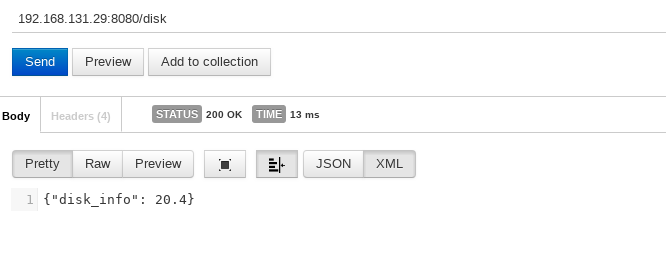
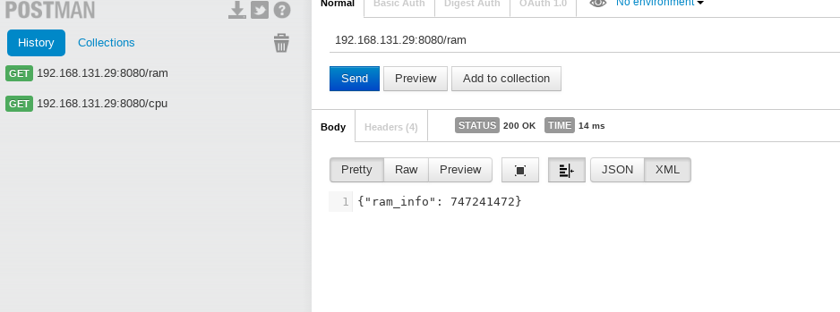
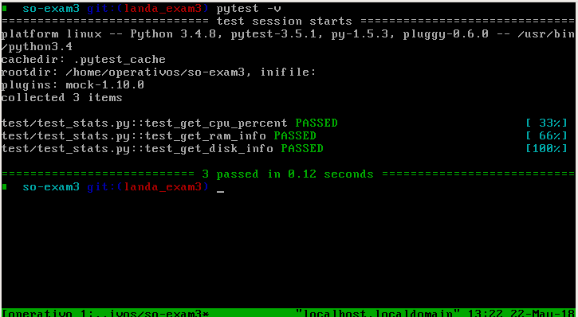
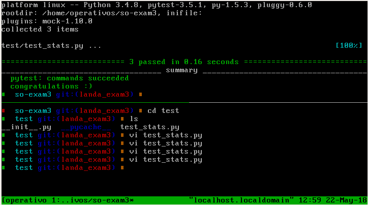
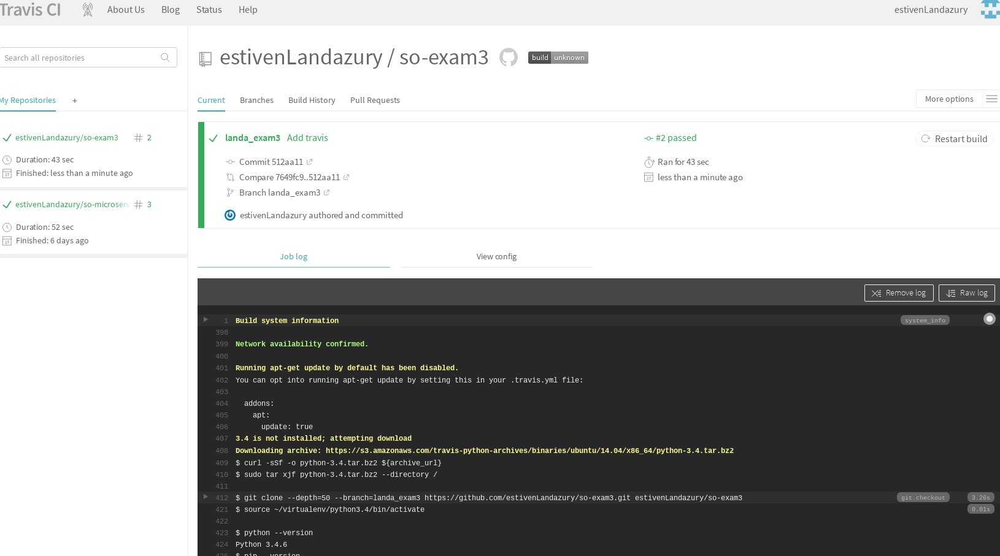
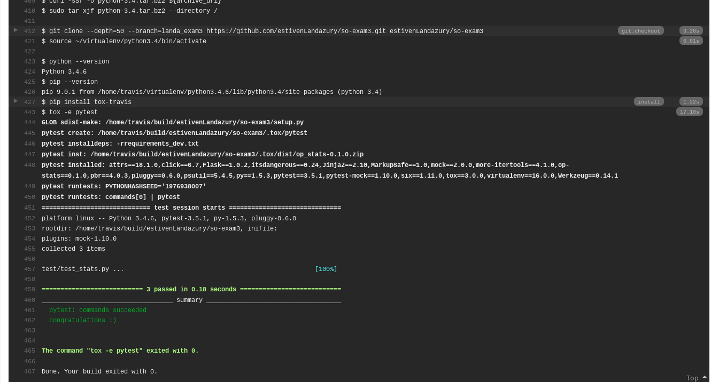
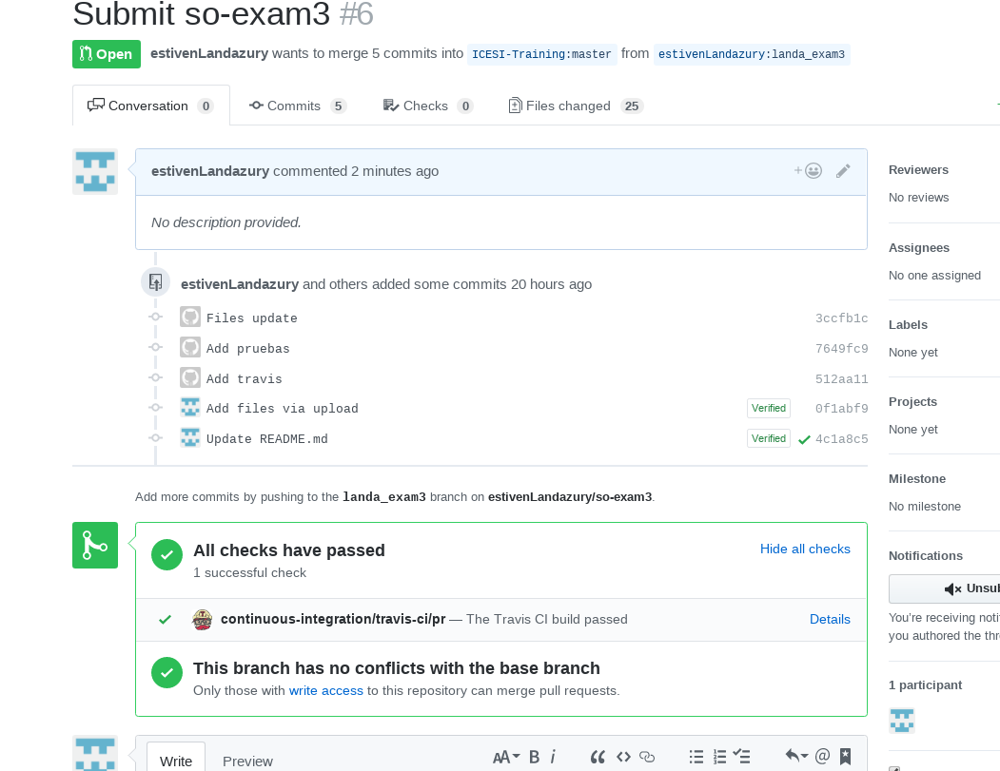

# so-exam3

**Universidad Icesi**  
**Nombre:** Estiven Landázury Salazar  
**Codigo:** A00056992
**Correo:** steven-salazar2012@hotmail.com  
**Repositorio:** https://github.com/estivenLandazury/so-exam3/

### punto3:  
Primero Instalamos un ambiente virtual para gestionar el desarrollo en el cual se encuentran las dependencias necesarias para el uso del mismo, creamos dos archivos requirements.txt y requirements_dev.txt los cuales contienen las dependencias que se utilizaran para implementar el servicio web flask.   

creamos una clase donde se ejecutaran los metodos necesarios para poder observar:  
Consumo de CPU (10%)  
Memoria RAM disponible (10%)  
Espacio disponible en disco (10%)  

```
import psutil  

class Stats():  

  @classmethod  
  def cpuPercent(cls):  
    cpuPercent = psutil.cpu_percent()      
    return  cpuPercent  

  @classmethod  
  def ram(cls):  
    ramMemory = psutil.virtual_memory()[1]  
    return  ramMemory  

  @classmethod     
  def disk(cls):  
    diskete = psutil.disk_usage('/')[3]  
    return  diskete  
```  

Despues creamos  un archivo app.py que es el que expone el servicio web flask, para poder observar la funcionalidad de los metodos creados anteriormente.  

```
from flask import Flask
import json
from op_stats.stats import Stats

app = Flask(__name__)

@app.route('/cpu')
def get_cpu_info():
  cpuInfo = Stats.cpuPercent()
  return json.dumps({'cpu_percent': cpuInfo})

@app.route('/ram')
def get_ram_info():
  ramInfo= Stats.ram()
  return json.dumps({'ram_info': ramInfo})

@app.route('/disk')
def get_disk_info():
  diskInfo = Stats.disk()
  return json.dumps({'disk_info': diskInfo})


if __name__ == '__main__':
    app.run(host='0.0.0.0',port=8080)
    
 ```  
  Se corre ejecuta el app.py:  
 ```
 $ python app.py
 ```  
 
 Acontinuación se muestra evidencia del uso de los servicios utilizando la extensión de postman:    

Llamada al servicio espacio disponible en el disco  

  

Llamada al servicio RAM disponible  

  

Llamada al servicio consumo de CPU  

   

### Punto 4: Implemente las pruebas unitarias para los servicios empleando Fixtures y Mocks como se vio en clase: 

Para la pruebas es necesario crear un archivo donde se realizaran las pruebas del servicio web, el archivo es llamado test_stats.py:  

```
import pytest
from op_stats.app import app
from op_stats.stats import Stats

@pytest.fixture
def client():
  client = app.test_client()
  return client

def test_get_cpu_percent(mocker, client):
  mocker.patch.object(Stats, 'cpuPercent', return_value=100)
  response = client.get('/cpu')
  assert response.data.decode('utf-8') == '{"cpu_percent": 100}'
  assert response.status_code == 200 


def test_get_ram_info(mocker, client):
  mocker.patch.object(Stats, 'ram' , return_value=100)
  response = client.get('/ram')
  assert response.data.decode('utf-8') == '{"ram_info": 100}'
  assert response.status_code ==200 

def test_get_disk_info(mocker, client):
  mocker.patch.object(Stats, 'disk' , return_value=100)
  response = client.get('/disk')
  assert response.data.decode('utf-8') == '{"disk_info": 100}'
  assert response.status_code ==200

```

Ahora corremos  las pruebas usando el comando de pytest, el cual busca las pruebas disponibles dentro
de nuestro directorio: 

```
pytest -v
```

   

## Punto 5:

para lograr la  integración continua creamos un archivo llamado  tox.ini, en este se especifica, la libreria para las  pruebas, el lenguaje base, el cual es python3 y al final especificamos  las dependencias que usaremos y el comando para realizar dichas pruebas:   

```
$ vi tox.ini

[tox]
envlist = pytest 

[testenv]
basepython = python3

[testenv:pytest]
deps =
  -rrequirements_dev.txt
commands =
  pytest
```  

Ahora usando el comando **tox**, se ejecutan las pruebas como se ven en la siguiente imagen:  


   

Por ultimo creamos un archivo llamado  **.travis.yml**, es cualse encarga de  guardar la configuracion basica para correr las pruebas realizadas por travis-ci.org, la cual se encarga de realizar pruebas para cada commit y pull request que se halla realizado sobre algún repositorio:  

```
$ vi .travis.yml

sudo: false
language: python
notifications:
  email: false
python:
- '3.4'
install: pip install tox-travis
script: tox -e pytest
```  
Primero accedemos a travis a travez de https://travis-ci.org/ e iniciamos sesión con nuestra cuenta de github. Luego buscamos nuestro repositorio so-exam3 y lo enlazamos con travis, A continuación se puede observar el funcionamiento de travis en las siguientes imágenes:   

  

   




